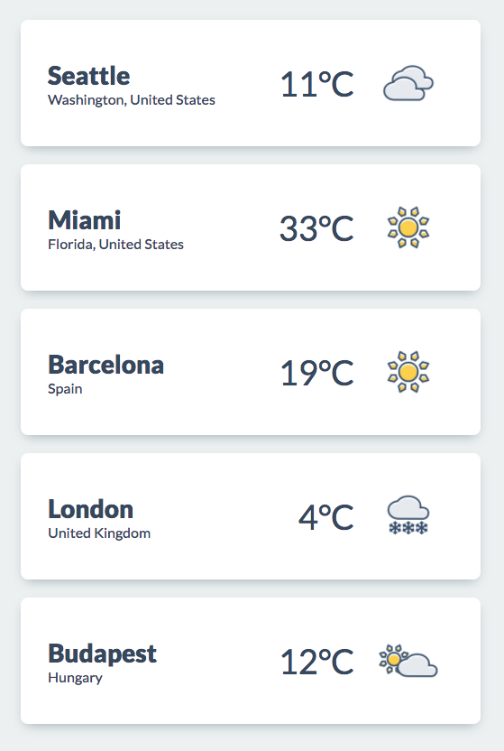

# Weather App - First Steps

## Goal

Getting familiar with components, services and third party API-s.

## Tasks

### 1. Dashboard screen

#### Requirements

- Create a component that looks like the image below.
- Use dedicated components for the tiles.
- Find Lato font face at [Google Fonts](https://fonts.google.com/) and use it.

#### Hints

- Weather icons can be found [here](./assets/icons).
- You can use hardcoded dummy data until you have a working service.

### 2. Create a service to retrieve weather info

#### Requirements

- Create a service to communicate with the
  [OpenWeatherMap API](https://openweathermap.org/).
- The service must be able to search current weather info by any input.

#### Hints

- Use environment files to store the API url.

### 3. Display result

#### Requirements

- Add an input field and a search button to the top of your home screen.
- Search for results if the user gives an input and clicks on search.
- Display the result by replacing the current content.
- (Optional) Search button must be disabled until the input filed is empty.

## Next steps

If you have finished all the tasks then move on to
[Testing and Component Interaction](./testing.md).
