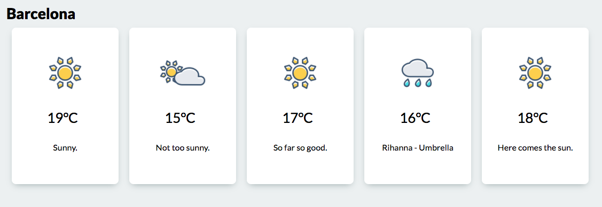

# Weather App - Testing & Component Interaction

## Goal

Learn and practice testing techniques and @Input parameters.

## Tasks

### 1. Test your service

#### Specification

- The service should return expected weather info. (HttpClient called once)
- The service should return an error when the server returns a 404.

#### Hints

- Take a look at angular's [Testing guide](https://angular.io/guide/testing).
  (until Component Test basics)

### 2. Forecast screen

#### Requirements

- Create a component which looks like the image below.
- Use dedicated components for the tiles.
- City id must be passed in through an @Input property.

#### Hints

- You will need to extend your current service to support the search by cityId.
- Take a look at angular's
  [Component Interaction guide](https://angular.io/guide/component-interaction#pass-data-from-parent-to-child-with-input-binding).

### 3. (Optional) Play with component tests

- Write some test to your Component class.
- Write some test to your Component DOM.

## What's next

Finally if you have finished everything, you can play with
[Routing & Navigation](./routing.md) to be able to navigate between your
components.
